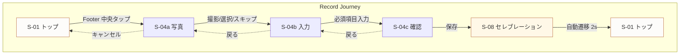
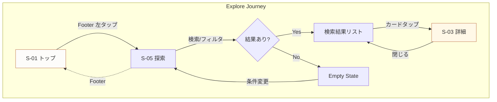
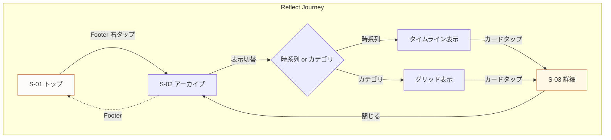
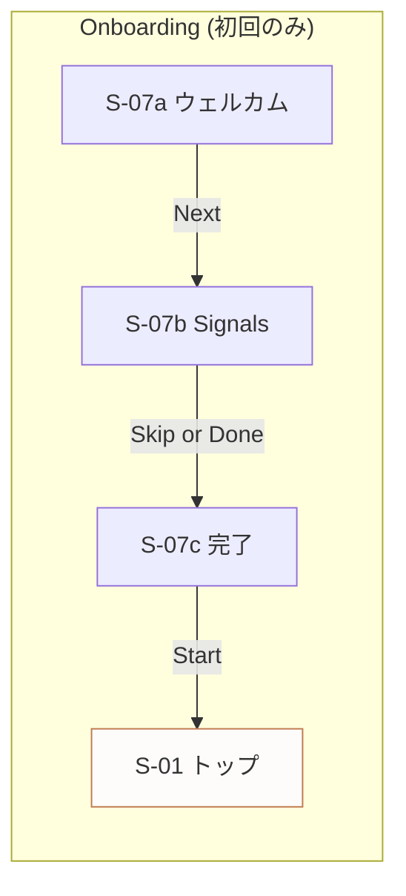
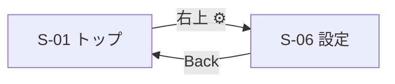

# 01: 画面フロー設計
_Screen Flows Specification_

---

## 概要

このドキュメントは、アプリ全体の画面構成と遷移フローを定義する。
トップ画面（キッチン世界）を起点とした全画面の関係性を明確にする。

**関連イシュー:** UX-001, UX-002, UX-005, UX-009, UX-014

---

## 1. 全画面一覧 (ref: UX-001)

| ID | 画面名 | 説明 | 進入経路 |
|----|--------|------|----------|
| S-01 | トップ（キッチン世界） | 2.5Dキッチン世界。常に呼吸している起点画面 | アプリ起動 / Footer / 通知ディープリンク（任意） |
| S-02 | アーカイブ（棚図鑑） | 料理カードのコレクション表示。時系列/カテゴリ切替 | Footer |
| S-03 | 料理カード詳細 | 個別の料理カード詳細モーダル | S-02 / S-05 からタップ |
| S-04 | 記録フロー | 料理記録の入力フロー（3ステップ） | Footer（中央） |
| S-04a | ├─ 写真撮影/選択 | カメラまたはフォトライブラリ。Footer非表示。キャンセルでS-01へ戻る | S-04 開始時 |
| S-04b | ├─ 入力フォーム | 料理名・メモ・タグ入力 | S-04a 完了後 |
| S-04c | └─ 確認・保存 | プレビューと保存ボタン | S-04b 完了後 |
| S-05 | 探索（検索・フィルタ） | 棚図鑑内の検索とフィルタリング | Footer / S-02 内 |
| S-06 | 設定 | アプリ設定とプロフィール | S-01 右上 |
| S-07 | オンボーディング | 初回体験フロー（3ステップ） | 初回起動時のみ |
| S-07a | ├─ ウェルカム | アプリ紹介 | 初回起動 |
| S-07b | ├─ Kitchen Signals | 年代/世帯/通知設定 | S-07a 後 |
| S-07c | └─ 完了 | 準備完了メッセージ | S-07b 後 |
| S-08 | セレブレーション | 記録完了時の演出オーバーレイ | S-04c 保存後 |

---

## 2. 3層構造とスクリーンマッピング (ref: UX-001)

World Bibleで定義された3層構造に基づき、各画面をマッピングする。

### 2.1 レイヤー定義

| レイヤー | 役割 | 動作特性 |
|----------|------|----------|
| **World（世界）** | 2.5Dキッチン世界 | 常に微細に動く（呼吸） |
| **UI** | 操作・情報表示 | 静止が基本、操作時のみ動く |
| **Effects（演出）** | 体験を増幅する演出 | トリガーベースで発火 |

### 2.2 画面別レイヤー構成

| 画面ID | World | UI | Effects | 備考 |
|--------|-------|-----|---------|------|
| S-01 トップ | ● 主役 | ○ Footer固定 | ○ 時間帯変化 | 世界が前面 |
| S-02 アーカイブ | △ 背景ぼかし | ● 主役 | - | UI が前面 |
| S-03 詳細 | △ 背景ぼかし | ● モーダル | - | オーバーレイ |
| S-04 記録 | △ 背景ぼかし | ● フルスクリーン | - | フォーカス |
| S-04a 写真 | - | ● カメラUI | - | システムUI、Footer非表示 |
| S-04b 入力 | △ 背景ぼかし | ● フォーム | - | 入力集中 |
| S-04c 確認 | △ 背景ぼかし | ● プレビュー | - | 確認集中 |
| S-05 探索 | △ 背景ぼかし | ● 主役 | - | 検索集中 |
| S-06 設定 | △ 背景ぼかし | ● 主役 | - | 設定画面 |
| S-07 オンボ | - | ● フルスクリーン | ○ アニメ | 没入体験 |
| S-08 セレブ | △ 見える | ○ 最小限 | ● 主役 | 演出が前面 |

**凡例:** ● 主役 / ○ 存在 / △ 控えめ / - なし

### 2.3 世界レイヤーの振る舞い

**重要: ルート/テーマ切り替えは存在しない。**
本アプリは「ルート」や「テーマ」による世界の切り替えを行わない。
代わりに、Kitchen Signals（年代グループ×3、世帯タイプ×2、時間帯×6、将来的に季節×4）を合成し、
キッチンの「空気感（atmosphere）」を動的に生成する。
カメラ位置は固定であり、時間帯が変わっても部屋の構図やレイアウトは変化しない。
変化するのは照明・トーン・オーバーレイのみである。

```
┌─────────────────────────────────────────┐
│  S-01 トップ: World = 100% visible      │
│  ┌─────────────────────────────────┐    │
│  │  Kitchen 2.5D (breathing)       │    │
│  │  - 固定カメラ構図               │    │
│  │  - 時間帯オーバーレイ（照明変化）│    │
│  │  - 季節エフェクト（将来）       │    │
│  │  - 年代/世帯プロップ            │    │
│  └─────────────────────────────────┘    │
│  [Footer: 固定]                         │
└─────────────────────────────────────────┘

┌─────────────────────────────────────────┐
│  S-02〜S-06: World = Blurred backdrop   │
│  ┌─────────────────────────────────┐    │
│  │  UI Screen (full content)       │    │
│  │  - World は blur(20px) で背景   │    │
│  │  - 呼吸アニメは継続             │    │
│  └─────────────────────────────────┘    │
│  [Footer: 固定]                         │
└─────────────────────────────────────────┘
```

---

## 3. フッターナビゲーション (ref: UX-001)

### 3.1 構成（3アイテム）

| 位置 | アイコン | ラベル | 遷移先 | 役割 |
|------|----------|--------|--------|------|
| 左 | 🔍 | 探索 | S-05 探索 | 過去を探す |
| 中央 | ➕ | 記録 | S-04 記録フロー | 今を記録する |
| 右 | 📚 | 棚 | S-02 アーカイブ | 蓄積を眺める |

### 3.2 デザイン仕様

```
┌─────────────────────────────────────────┐
│                                         │
│           (Screen Content)              │
│                                         │
├─────────────────────────────────────────┤
│  ┌───────┐   ┌───────────┐   ┌───────┐  │  Footer: 固定高さ 56pt
│  │  🔍   │   │    ➕     │   │  📚   │  │  Safe area 対応
│  │ 探索  │   │   記録    │   │   棚  │  │
│  └───────┘   └───────────┘   └───────┘  │
│     32pt        48pt           32pt     │  中央ボタン: 強調
└─────────────────────────────────────────┘
```

### 3.3 状態

| 状態 | 視覚表現 |
|------|----------|
| Default | アイコン: 80% opacity, ラベル: 表示（小サイズ） |
| Active | アイコン: 100% + accent color, ラベル: 強調表示 |
| Recording Active | 中央ボタン: 微細な pulse アニメーション（※Reduced Motion時は静止） |

### 3.4 フッター非表示条件

- S-04 記録フロー中（全画面フォーカス）
- S-07 オンボーディング中
- S-08 セレブレーション中
- カメラ/フォトライブラリ表示中（S-04a）

---

## 4. コアジャーニー (ref: UX-001)

### 4.1 Record（記録する）- 最重要

> 「今日作った料理を3ステップで残す」



**KPI:** 3ステップ・3決定タップ（開始 / 写真決定 / 保存）で記録完了。目標30秒以内。

**「3決定タップ」の定義:**
1. **開始タップ** — Footer中央の「記録」をタップ
2. **写真決定タップ** — 撮影 / ライブラリ選択 / スキップのいずれかを選択
3. **保存タップ** — 確認画面で「保存」をタップ

※料理名入力などのフォーム操作は「決定タップ」にカウントしない（テキスト入力は別軸の操作）。

**ステップ詳細:**

| Step | 画面 | ユーザー操作 | 決定タップ | システム応答 |
|------|------|--------------|------------|--------------|
| 1 | S-01 | Footerの「記録」タップ | ① 開始 | S-04a へ遷移、Footer非表示 |
| 2 | S-04a | 写真撮影/選択/スキップ | ② 写真決定 | S-04b へ遷移 |
| 3 | S-04b | 料理名入力（必須）+ 任意項目 | - | バリデーション、次へ進む |
| 4 | S-04c | 「保存」タップ | ③ 保存 | データ保存 + S-08 |
| 5 | S-08 | （観賞） | - | 2秒後 S-01 へ |

### 自動記録仕様

| データ項目 | 記録タイミング | 値 |
|-----------|--------------|-----|
| 作成日時 | S-04c 保存タップ時 | 端末ローカル時刻 |
| 作成回数 | 同上 | 既存カードなら +1、新規なら 1 |
| 最終作成日 | 同上 | 作成日時と同値 |

**注:** ユーザーは日付・回数を手動入力しない。自動で付与される。

---

### 4.2 Explore（探索する）

> 「過去の記録から料理を探し出す」



**検索手段:**
- テキスト検索（料理名）
- タグフィルタ
- 日付範囲
- お気に入りフィルタ

---

### 4.3 Reflect（振り返る）

> 「蓄積された記録を眺めて思い出す」



**振り返りモード:**
- 時系列ビュー: 縦スクロール、日付ヘッダー
- カテゴリビュー: グリッド、タグ別グループ

---

## 5. 画面遷移マトリクス (ref: UX-001)

### 5.1 遷移可能性マトリクス

| From ＼ To | S-01 | S-02 | S-03 | S-04 | S-05 | S-06 |
|------------|------|------|------|------|------|------|
| S-01 トップ | - | Footer | - | Footer | Footer | Header |
| S-02 アーカイブ | Footer | - | Tap | Footer | Footer | - |
| S-03 詳細 | - | Close | - | - | - | - |
| S-04 記録 | Done/Cancel | - | - | - | - | - |
| S-05 探索 | Footer | Footer | Tap | Footer | - | - |
| S-06 設定 | Back | - | - | - | - | - |

### 5.2 遷移パターン

| パターン | アニメーション | 適用場面 |
|----------|----------------|----------|
| Footer遷移 | Crossfade 200ms | Footer間の移動 |
| 階層下降 | Slide Right 250ms | 棚 → 詳細 |
| 階層上昇 | Slide Left 250ms | 詳細 → 棚 |
| オーバーレイ | Slide Up 300ms | 記録フロー開始 |
| モーダル | Scale + Fade 250ms | 詳細カード表示 |
| 完了 | Slide Down 300ms | 記録フロー完了 |

---

## 6. 特殊フロー

### 6.1 オンボーディングフロー



### 6.2 設定アクセス



**設定画面は Footer からアクセスしない**（頻度が低いため）

---

## 7. 遷移詳細仕様

### 7.1 Footer 遷移

```
[Current Screen] → Fade Out (100ms) → Fade In (100ms) → [Next Screen]
- World layer: 維持（blur 状態は変化しうる）
- Footer: 固定、アイコン状態のみ変化
```

### 7.2 記録フロー開始

```
[S-01 トップ]
  ↓ Footer「記録」タップ
[S-04 Overlay] Slide Up from bottom (300ms, ease-out)
  - World: blur(20px) へ遷移
  - Footer: 非表示
```

### 7.3 記録フローキャンセル（S-04a から）

```
[S-04a 写真]
  ↓ キャンセルタップ
[S-01 トップ] Slide Down (300ms, ease-out)
  - World: blur解除
  - Footer: 再表示
  - 世界の中断を最小化
```

### 7.4 セレブレーション

```
[S-04c 確認] 保存完了
  ↓
[S-08 セレブレーション]
  - World: visible (blur解除)
  - 演出: particle + sound (1.5s)
  - 自動遷移: 2s後 → S-01
```

---

## 8. TODO / 未決定事項

- [ ] フッターアイコンの最終決定（UX-020待ち）
- [x] 記録フローのステップ詳細 → **02-core-wireframes.md §S-04 で定義済み**
- [x] オンボーディングのステップ数 → **3ステップ（S-07a/b/c）で決定**
- [x] 設定画面の項目構成 → **02-core-wireframes.md §S-06 で定義済み**

---

## 9. 更新履歴

| 日付 | 更新内容 | 担当 |
|------|---------|------|
| 2026-02-01 | 初版作成 | - |
| 2026-02-01 | UX-001対応: Footer 3アイテム化、コアジャーニー定義、Mermaid追加、レイヤーマッピング追加 | Claude |
| 2026-02-01 | 3タップ定義明確化、ルート/テーマ切替なし明記、Footerラベル常時表示、TODO参照修正 | Claude |
| 2026-02-01 | UX-005対応: 自動記録仕様追加、Pencil→Figma Build Sheet移行 | Claude |

---

---

# Figma Build Sheet (ref: UX-001)

> Figma でのデザイン作成用ガイド

---

## Frame 定義

### 画面フレーム

| Frame Name | Size (pt) | 用途 |
|------------|-----------|------|
| `screen-top` | 390 × 844 | S-01 トップ |
| `screen-archive` | 390 × 844 | S-02 アーカイブ |
| `screen-detail` | 390 × 844 | S-03 詳細モーダル |
| `screen-record-photo` | 390 × 844 | S-04a 写真 |
| `screen-record-input` | 390 × 844 | S-04b 入力 |
| `screen-record-confirm` | 390 × 844 | S-04c 確認 |
| `screen-explore` | 390 × 844 | S-05 探索 |
| `screen-settings` | 390 × 844 | S-06 設定 |
| `screen-onboard-1` | 390 × 844 | S-07a ウェルカム |
| `screen-onboard-2` | 390 × 844 | S-07b Signals |
| `screen-onboard-3` | 390 × 844 | S-07c 完了 |
| `screen-celebration` | 390 × 844 | S-08 セレブレーション |

### コンポーネントフレーム

| Frame Name | Size (pt) | 用途 |
|------------|-----------|------|
| `comp-footer` | 390 × 56 | Footer ナビゲーション |
| `comp-footer-item` | 80 × 48 | Footer 各アイテム |
| `comp-header` | 390 × 44 | ヘッダーバー |
| `comp-card-small` | 170 × 200 | 料理カード（グリッド用） |
| `comp-card-list` | 358 × 80 | 料理カード（リスト用） |

---

## Flow Diagram ノード

### Record Journey

| Node ID | Label | Position (grid) | Shape |
|---------|-------|-----------------|-------|
| `rec-01` | S-01 トップ | 0, 0 | Rounded rect |
| `rec-02` | S-04a 写真 | 1, 0 | Rounded rect |
| `rec-03` | S-04b 入力 | 2, 0 | Rounded rect |
| `rec-04` | S-04c 確認 | 3, 0 | Rounded rect |
| `rec-05` | S-08 セレブ | 4, 0 | Diamond (演出) |
| `rec-06` | S-01 トップ | 5, 0 | Rounded rect |

**レイアウト:** 横一列、左→右、間隔 120pt

### Explore Journey

| Node ID | Label | Position (grid) | Shape |
|---------|-------|-----------------|-------|
| `exp-01` | S-01 トップ | 0, 0 | Rounded rect |
| `exp-02` | S-05 探索 | 1, 0 | Rounded rect |
| `exp-03` | 結果あり? | 2, 0 | Diamond (分岐) |
| `exp-04` | 結果リスト | 2, 1 | Rounded rect |
| `exp-05` | Empty State | 2, -1 | Dashed rect |
| `exp-06` | S-03 詳細 | 3, 1 | Rounded rect |

**レイアウト:** 分岐を含む、間隔 100pt

### Reflect Journey

| Node ID | Label | Position (grid) | Shape |
|---------|-------|-----------------|-------|
| `ref-01` | S-01 トップ | 0, 0 | Rounded rect |
| `ref-02` | S-02 アーカイブ | 1, 0 | Rounded rect |
| `ref-03` | 表示切替 | 2, 0 | Diamond |
| `ref-04` | タイムライン | 2, 1 | Rounded rect |
| `ref-05` | カテゴリ | 2, -1 | Rounded rect |
| `ref-06` | S-03 詳細 | 3, 0 | Rounded rect |

**レイアウト:** 分岐を含む、間隔 100pt

---

## 色・スタイル

| 要素 | Fill | Stroke | 備考 |
|------|------|--------|------|
| 通常ノード | #FDFCFA | #2C2825 1pt | 画面 |
| 強調ノード | #FFF8E7 | #C17A50 2pt | 起点・終点 |
| 分岐ノード | #F5F5F5 | #2C2825 1pt | Diamond |
| 矢印（進行） | - | #2C2825 1pt | Solid |
| 矢印（戻る） | - | #999999 1pt | Dashed |

---

## Export ファイル

### 配置先

```
docs/ux/phase-1/pencil/exports/
```

### ファイル一覧

| Filename | 内容 | Format | Size |
|----------|------|--------|------|
| `flows-overview-v1.svg` | 全体フロー俯瞰図 | SVG | - |
| `flow-record-v1.svg` | Record Journey | SVG | - |
| `flow-explore-v1.svg` | Explore Journey | SVG | - |
| `flow-reflect-v1.svg` | Reflect Journey | SVG | - |
| `flow-onboarding-v1.svg` | オンボーディング | SVG | - |
| `screen-matrix-v1.png` | 遷移マトリクス表 | PNG | @2x |
| `comp-footer-v1.svg` | Footer コンポーネント | SVG | - |
| `layer-structure-v1.svg` | 3層構造図 | SVG | - |

### 命名規則

```
{type}-{name}-v{version}.{ext}

type: flows, flow, screen, comp, layer
name: 英小文字ハイフン区切り
version: 整数（1, 2, 3...）
ext: svg（ベクター）または png（ラスター @2x）
```

---

## チェックリスト

Figma でのフロー図作成前に確認:

- [ ] 全12画面フレームを作成
- [ ] Footer コンポーネントを作成（3アイテム、ラベル常時表示）
- [ ] Record Journey フロー図を作成
- [ ] Explore Journey フロー図を作成
- [ ] Reflect Journey フロー図を作成
- [ ] 色・ストロークが Design Tokens に準拠
- [ ] PNG/SVG でエクスポート、exports/ に配置
- [ ] ファイル名が命名規則に準拠
